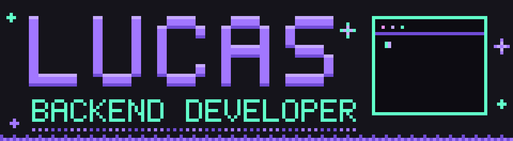

  

###

  <a href="https://www.linkedin.com/in/lucas-sanches-8342a5366?utm_source=share_via&utm_content=profile&utm_medium=member_android" target="_blank">
    
  

###

<h1 data-importer="text" align="center">Olá 👋</h1>

###

<h3 data-importer="text" align="left">👨‍💻  Sobre mim</h3>

###

Sou um estudante no 4º período de Engenharia de Computação  - 🔭 Estou desenvolvendo projetos backend com Java e Spring Boot - 📚 Estou aprendendo APIs REST seguras (JWT), Docker e testes com Mockito - ⚡ No meu tempo livre pratico Java e crio pequenos projetos.

###

<h3 data-importer="text" align="left">🛠 Linguagens e Ferramentas</h3>

###

  
  
  
  
  
  
  
  
  
  
  
  
  
  
  
  
  
  
  
  
  
  
  

###

<h3 data-importer="text" align="left">🔥   Minhas Estatísticas :</h3>

###

  
  
  

###

<picture data-importer="pacman">
  <source media="(prefers-color-scheme: dark)" srcset="https://raw.githubusercontent.com/LucasSanchesM/LucasSanchesM/pacman-output/breakout-contribution-graph-dark.svg?game=breakout">
  <source media="(prefers-color-scheme: light)" srcset="https://raw.githubusercontent.com/LucasSanchesM/LucasSanchesM/pacman-output/breakout-contribution-graph.svg?game=breakout">
  
</picture>

###
